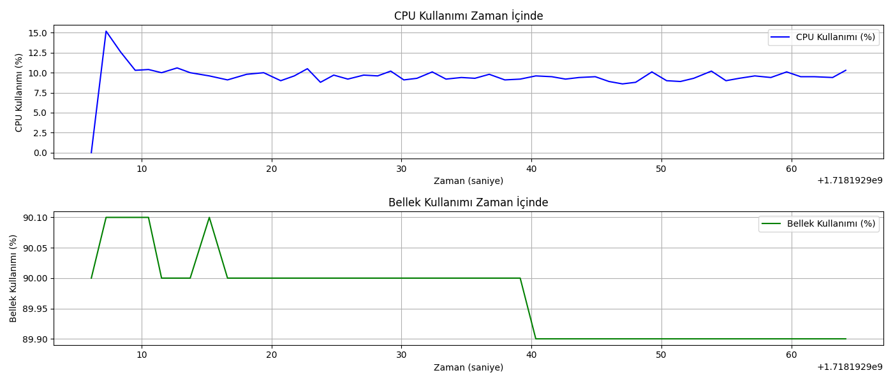

Fizibilite Raporu: Sistem Stres Testi ve Analizi
Giriş:
Bu fizibilite raporu, büyük ölçekli dağıtık sistemlerin dayanıklılığını ve performansını değerlendirmek için kullanılan bir teknik olan sistem stres testini ele alır. Sistem stres testi, sistemin sınırlarını belirlemek ve beklenmedik yükler altında nasıl davrandığını görmek için yapılır. Bu yöntem, sistemin güvenilirliğini ve performansını artırmak için önemli bilgiler sağlar.

Amaç ve Hedefler
Bu analizin ana amacı, sistemin dayanıklılığını ve performansını değerlendirmek ve iyileştirmek için sistem stres testi kullanmaktır. Bu raporun hedefleri şunlardır:

Sistemin sınırlarını ve zayıf noktalarını belirlemek.
Sistemin yüksek yük altında nasıl davrandığını gözlemlemek.
Sistemin performansını ve stabilitesini değerlendirmek.
Analiz sonuçlarına dayanarak sistemin iyileştirilmesi için öneriler sunmak.
Sistem Stres Testi Yöntemi
Sistem stres testi için izlenecek adımlar şunlardır:
Fizibilite Raporu: Sistem Stres Testi ve Analizi
Giriş
Bu fizibilite raporu, büyük ölçekli dağıtık sistemlerin dayanıklılığını ve performansını değerlendirmek için kullanılan bir teknik olan sistem stres testini ele alır. Sistem stres testi, sistemin sınırlarını belirlemek ve beklenmedik yükler altında nasıl davrandığını görmek için yapılır. Bu yöntem, sistemin güvenilirliğini ve performansını artırmak için önemli bilgiler sağlar.

Amaç ve Hedefler
Bu analizin ana amacı, sistemin dayanıklılığını ve performansını değerlendirmek ve iyileştirmek için sistem stres testi kullanmaktır.
Bu raporun hedefleri şunlardır:

Sistemin sınırlarını ve zayıf noktalarını belirlemek.
Sistemin yüksek yük altında nasıl davrandığını gözlemlemek.
Sistemin performansını ve stabilitesini değerlendirmek.
Analiz sonuçlarına dayanarak sistemin iyileştirilmesi için öneriler sunmak.
Sistem Stres Testi Yöntemi
Sistem stres testi için izlenecek adımlar şunlardır:

Test senaryolarının tanımlanması: Farklı yük senaryoları ve stres testlerinin belirlenmesi.
Test ortamının kurulması: Gerekli donanım ve yazılım kaynaklarının hazırlanması.
Testlerin gerçekleştirilmesi: Belirlenen senaryoların uygulanması ve sonuçların kaydedilmesi.
Sonuçların analiz edilmesi: Test sonuçlarının değerlendirilmesi ve sistemin performansının incelenmesi.
İyileştirme önerilerinin sunulması: Analiz sonuçlarına dayanarak sistemde yapılması gereken iyileştirmelerin belirlenmesi.
Sonuçlar ve Değerlendirme
Sistem stres testi sonuçlarına dayanarak şu değerlendirmeler yapılabilir:

Sistemin sınırları ve zayıf noktaları belirlenebilir.
Yüksek yük altında sistemin performansı ve stabilitesi değerlendirilir.
Gelecekteki yük artışlarına karşı sistemin dayanıklılığı belirlenir.
Öneriler ve Sonuç

SWOT Analizi: Sistem Stres Testi ve Analizi
Güçlü Yönler (Strengths):

Sistem performansını ve dayanıklılığını artırır.
Olası zayıf noktaları önceden tespit eder.
Kullanıcı memnuniyetini artırır.
Zayıf Yönler (Weaknesses):

Uygulaması zaman alıcı ve karmaşık olabilir.
Yüksek maliyetler doğurabilir.
Doğru yapılandırılmadığında yanıltıcı sonuçlar verebilir.
Fırsatlar (Opportunities):

Bulut tabanlı sistemlerin ve mikroservis mimarilerinin yaygınlaşması.
Artan dijitalleşme ile birlikte performans testlerine duyulan ihtiyaç.
Yeni araçların ve teknolojilerin gelişimi.
Tehditler (Threats):

Yanlış kullanım sonucu veri kaybı veya sistem arızası.
Test sırasında oluşabilecek performans sorunları.
Yeterli bilgi ve deneyim olmadan uygulama riskleri.
Test senaryolarının tanımlanması: Farklı yük senaryoları ve stres testlerinin belirlenmesi.
Test ortamının kurulması: Gerekli donanım ve yazılım kaynaklarının hazırlanması.
Testlerin gerçekleştirilmesi: Belirlenen senaryoların uygulanması ve sonuçların kaydedilmesi.
Sonuçların analiz edilmesi: Test sonuçlarının değerlendirilmesi ve sistemin performansının incelenmesi.
İyileştirme önerilerinin sunulması: Analiz sonuçlarına dayanarak sistemde yapılması gereken iyileştirmelerin belirlenmesi.
Sonuçlar ve Değerlendirme
Sistem stres testi sonuçlarına dayanarak şu değerlendirmeler yapılabilir:

Sistemin sınırları ve zayıf noktaları belirlenebilir.
Yüksek yük altında sistemin performansı ve stabilitesi değerlendirilir.
Gelecekteki yük artışlarına karşı sistemin dayanıklılığı belirlenir.

Öneriler ve Sonuç:

SWOT Analizi: Sistem Stres Testi ve Analizi
Güçlü Yönler (Strengths):

Sistem performansını ve dayanıklılığını artırır.
Olası zayıf noktaları önceden tespit eder.
Kullanıcı memnuniyetini artırır.
Zayıf Yönler (Weaknesses):

Uygulaması zaman alıcı ve karmaşık olabilir.
Yüksek maliyetler doğurabilir.
Doğru yapılandırılmadığında yanıltıcı sonuçlar verebilir.
Fırsatlar (Opportunities):

Bulut tabanlı sistemlerin ve mikroservis mimarilerinin yaygınlaşması.
Artan dijitalleşme ile birlikte performans testlerine duyulan ihtiyaç.
Yeni araçların ve teknolojilerin gelişimi.
Tehditler (Threats):

Yanlış kullanım sonucu veri kaybı veya sistem arızası.
Test sırasında oluşabilecek performans sorunları.
Yeterli bilgi ve deneyim olmadan uygulama riskleri.
